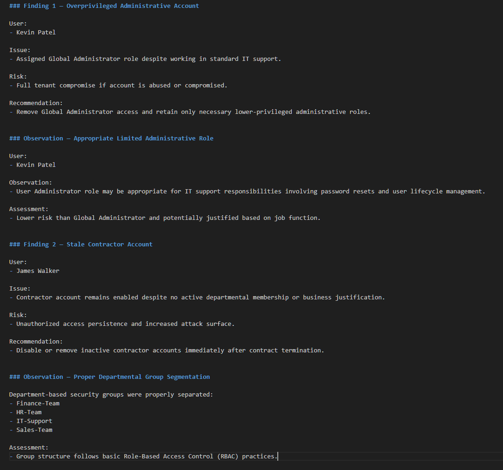
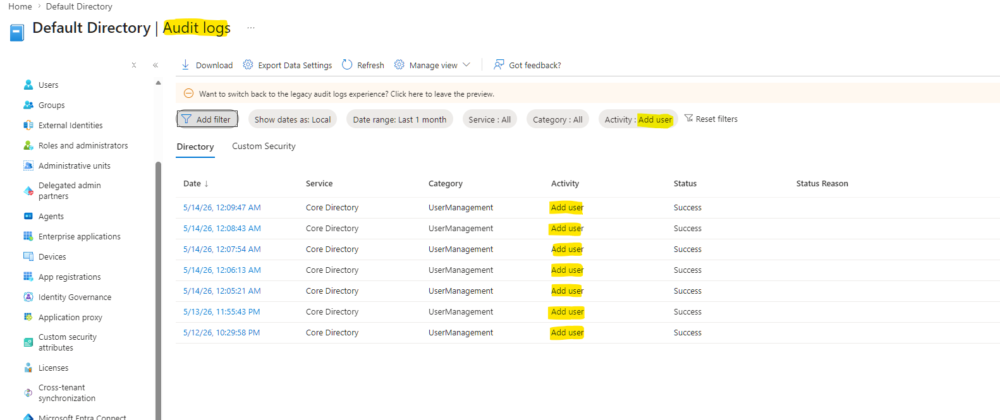

# Microsoft Entra ID IAM Access Review Lab

## Project Overview

This project simulates a real-world Identity and Access Management (IAM) security review using Microsoft Entra ID Free.

The lab was designed to emulate the responsibilities of a security analyst performing:
- Access reviews
- Administrative privilege analysis
- Identity lifecycle management
- IAM remediation
- Audit log investigation
- Identity monitoring
- MFA/security hardening review

The environment intentionally included security misconfigurations to simulate realistic enterprise IAM risks.

## Key Project Highlights

### IAM Access Review Findings

### Entra Audit Log Investigation

### Sign-In Investigation

## Technologies Used

- Microsoft Entra ID Free
- Microsoft Entra Admin Center
- RBAC (Role-Based Access Control)
- Microsoft Audit Logs
- Microsoft Sign-In Logs
- MFA / Security Defaults
- Identity Governance Concepts

## Skills Demonstrated

- User provisioning
- Security group administration
- Administrative role assignment
- Least privilege analysis
- Access review methodology
- Identity lifecycle management
- Audit log investigation
- Authentication monitoring
- IAM remediation workflows
- Security documentation

## Project Workflow

1. Environment setup
2. User provisioning
3. Security group creation
4. Intentional IAM misconfiguration
5. Manual access review
6. IAM remediation
7. Audit log investigation
8. Joiner-Mover-Leaver lifecycle simulation
9. MFA/security hardening review
10. Sign-in log investigation
11. Executive security reporting

## Screenshots

Screenshots documenting each phase of the IAM review process are included in the `/screenshots` directory.

## Final Summary

This project provided hands-on experience with cloud IAM administration and security operations concepts using Microsoft Entra ID.

The lab emphasized:
- identity governance
- least privilege enforcement
- privileged access review
- audit investigation
- cloud identity security monitoring

This simulated practical IAM analyst responsibilities commonly encountered in enterprise environments.