# Microsoft Entra ID IAM Access Review Lab

## Scenario
I am acting as a security analyst for a fictional company called Northstar Financial Group.

The company needs a manual IAM access review to identify:
- Overprivileged users
- Inactive or stale accounts
- Users assigned risky administrative roles
- Poor group membership hygiene

## Goal
Review user access in Microsoft Entra ID, identify IAM security risks, document findings, and remediate access issues using least privilege principles.

## Tools Used
- Microsoft Entra ID Free
- Microsoft Entra Admin Center
- Manual access review checklist
- GitHub documentation

## Analyst Tasks
- Create test users
- Assign roles and groups
- Introduce intentional IAM issues
- Perform access review
- Document findings
- Remove or reduce unnecessary access

## Step 1: Lab Setup and Project Scope

In this step, I confirmed access to Microsoft Entra ID and created the project scope for a simulated IAM access review.

The lab scenario is based on a fictional company, Northstar Financial Group. The objective is to act as a security analyst reviewing user access, identifying excessive permissions, finding stale accounts, and applying least privilege remediation.

### Microsoft Entra Admin Center
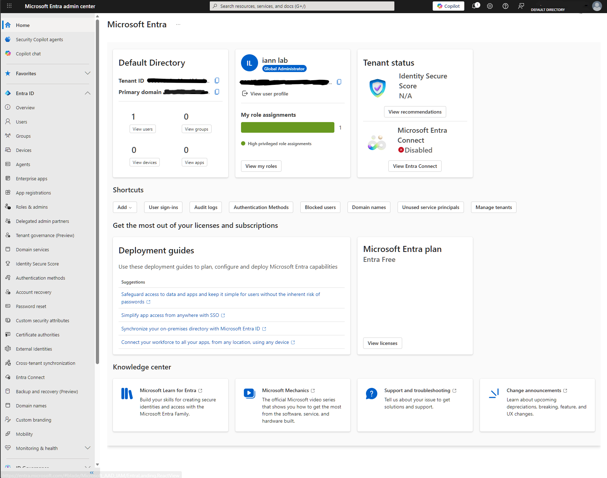

### Initial User Management View
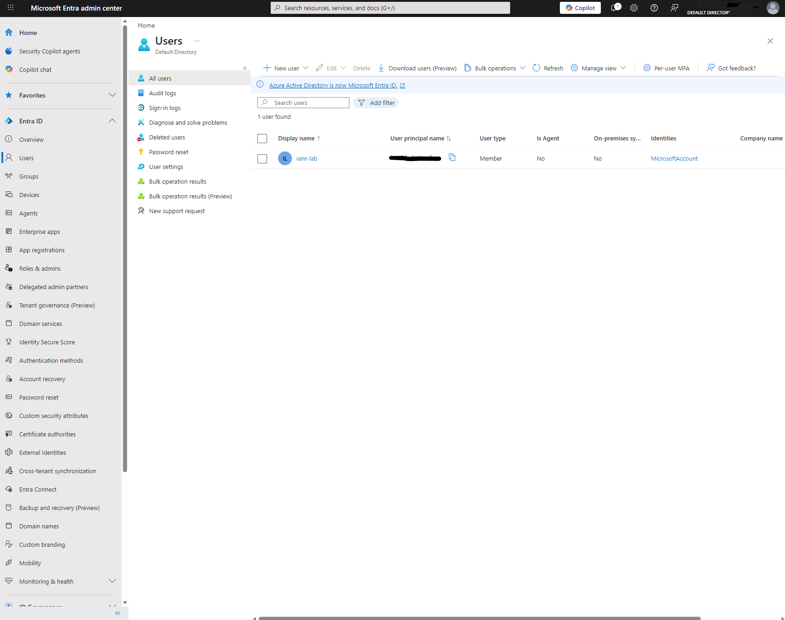

## Step 2: Creating Organizational User Accounts

To simulate a real business environment, I created multiple user identities in Microsoft Entra ID representing different departments and job functions.

The accounts included:
- Finance Manager
- HR Specialist
- IT Support
- Sales Employee
- Former Contractor

This structure allows realistic IAM auditing scenarios involving role assignments, stale accounts, and excessive privilege review.

Key IAM concepts practiced:
- User provisioning
- Identity lifecycle management
- Organizational role separation
- Cloud identity administration

### Organizational User Accounts
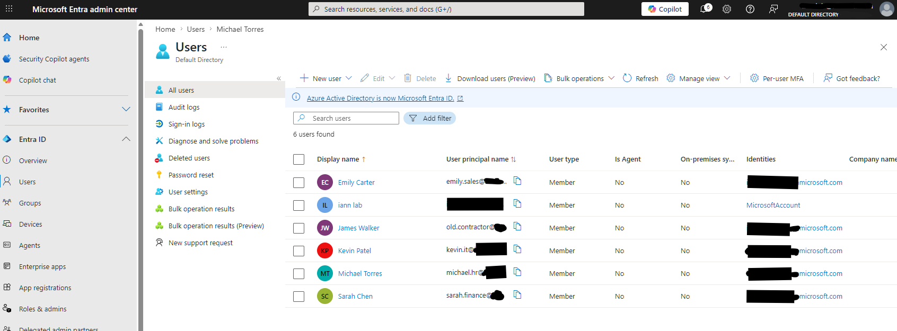

### Example User Profile
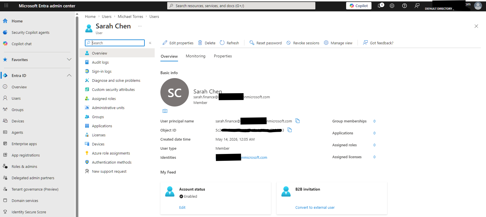

## Step 3: Creating Security Groups and Simulating IAM Misconfigurations

To simulate a realistic enterprise IAM environment, departmental security groups were created and populated with user accounts.

Security groups created:
- Finance-Team
- HR-Team
- IT-Support
- Sales-Team

After establishing normal access structures, intentional IAM security issues were introduced for later analysis during the access review process.

Misconfigurations introduced:
- Kevin Patel (IT Support) was assigned both User Administrator and Global Administrator roles, creating an overprivileged account.
- A contractor account (James Walker) remained enabled without departmental group membership, simulating a stale or unmanaged identity.

### Overprivileged Administrative Account
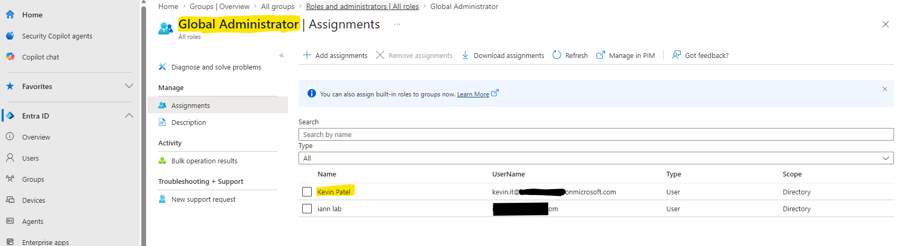

### Stale Contractor Account
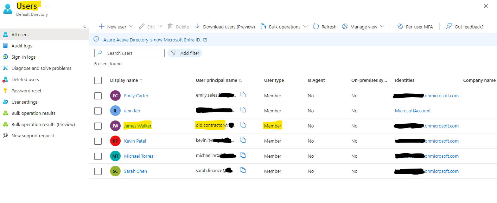

Key IAM concepts practiced:
- Role-Based Access Control (RBAC)
- Security group management
- Administrative role assignment
- Principle of Least Privilege violations
- Stale account identification

## Step 4: Performing a Manual IAM Access Review

A manual IAM access review was conducted to identify security risks and validate access assignments within Microsoft Entra ID.

Review activities included:
- Administrative role analysis
- Stale account identification
- Security group validation
- Least privilege assessment

Security findings identified:
1. Overprivileged IT support account with Global Administrator access
2. Enabled stale contractor account lacking business justification

### Global Administrator Review

### Contractor Account Investigation
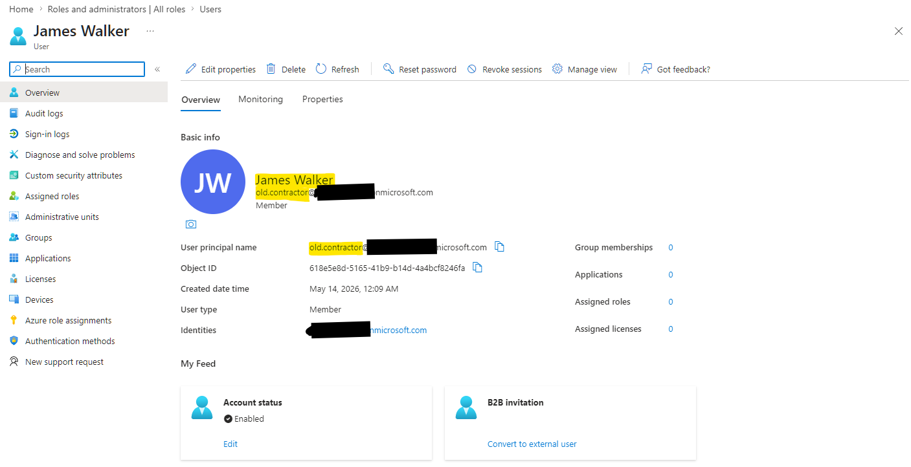

### RBAC Group Segmentation
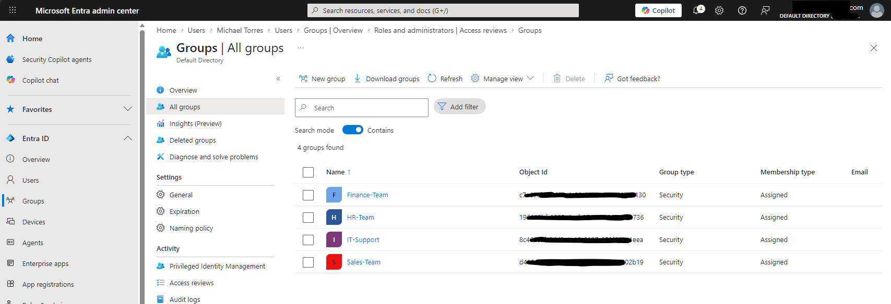

Positive observations:
- Departmental security group segmentation aligned with RBAC principles
- Limited administrative access through User Administrator role appeared operationally appropriate

Key IAM concepts practiced:
- Access review methodology
- Least privilege analysis
- Privileged account auditing
- Identity governance fundamentals
- Risk assessment documentation
  

### Finding 1 — Overprivileged Administrative Account
  
  User:
  - Kevin Patel
  
  Issue:
  - Assigned Global Administrator role despite working in standard IT support.
  
  Risk:
  - Full tenant compromise if account is abused or compromised.
  
  Recommendation:
  - Remove Global Administrator access and retain only necessary lower-privileged administrative roles.

### Observation — Appropriate Limited Administrative Role
  
  User:
  - Kevin Patel
  
  Observation:
  - User Administrator role may be appropriate for IT support responsibilities involving password resets and user lifecycle management.
  
  Assessment:
  - Lower risk than Global Administrator and potentially justified based on job function.
  
  
  
### Finding 2 — Stale Contractor Account
  
  User:
  - James Walker
  
  Issue:
  - Contractor account remains enabled despite no active departmental membership or business justification.
  
  Risk:
  - Unauthorized access persistence and increased attack surface.
  
  Recommendation:
  - Disable or remove inactive contractor accounts immediately after contract termination.

### Observation — Proper Departmental Group Segmentation
  
  Department-based security groups were properly separated:
  - Finance-Team
  - HR-Team
  - IT-Support
  - Sales-Team
  
  Assessment:
  - Group structure follows basic Role-Based Access Control (RBAC) practices.

## Step 5: IAM Remediation and Least Privilege Enforcement

Following the access review, identified IAM security risks were remediated using least privilege principles.

Remediation actions:
- Removed unnecessary Global Administrator access from an IT support account
- Retained operationally appropriate User Administrator permissions
- Disabled a stale contractor account lacking business justification

Key IAM concepts practiced:
- Privileged access remediation
- Least privilege enforcement
- Identity lifecycle management
- Stale account handling
- Administrative role reduction

### Troubleshooting Note — Administrative Role Removal

While attempting to remediate excessive privileges, the Global Administrator assignment could not initially be removed.

Additional investigation was performed to determine:
- assignment source
- inheritance method
- role assignment type

An issue was encountered while attempting to remove a directly assigned Global Administrator role in the Entra ID free tenant.

Troubleshooting performed:
- Verified assignment type
- Confirmed direct assignment
- Attempted removal through both role and user assignment views
- Refreshed administrative session

This demonstrated real-world IAM troubleshooting involving cloud identity administration behavior and permission propagation.

### Remediation Exception — Global Administrator Role Removal Failure

During remediation, attempts were made to remove excessive administrative privileges from the Kevin Patel account.

Observed behavior:
- Role removal options remained unavailable/grayed out
- Issue persisted across:
  - User role assignment view
  - Role administration view
  - New browser session
  - Reauthentication attempts

Assessment:
- Likely related to Microsoft Entra ID Free tenant limitations, role propagation behavior, or administrative control-plane restrictions within the newly created lab environment.

Impact:
- Excessive privilege risk remained identified but documented.

Planned Enterprise Escalation:
- Escalate to senior identity administrator or Microsoft support for privileged role remediation assistance.

Although the stale contractor account was successfully remediated, administrative role removal actions encountered platform limitations within the Microsoft Entra ID Free tenant environment.

Troubleshooting and escalation documentation were completed as part of the remediation workflow.

### Remove Overpriveleged Admin
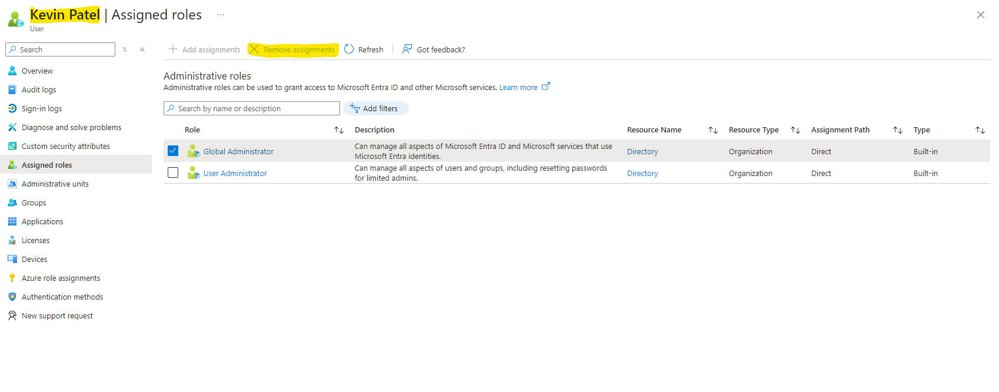

### Contractor Account Disabled
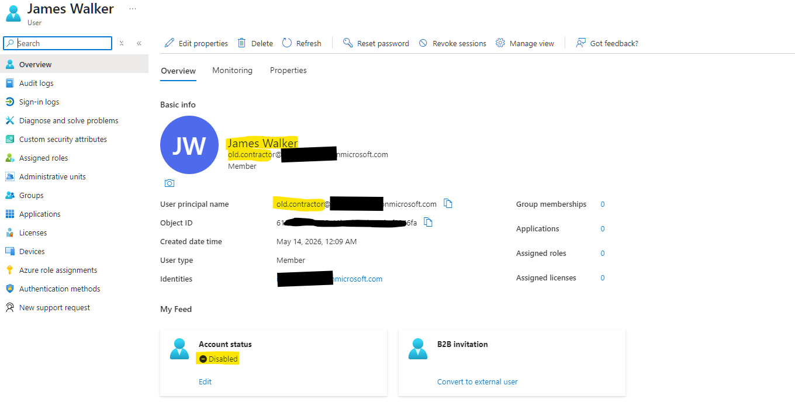

## Step 6: Audit Log Investigation

Audit logs within Microsoft Entra ID were reviewed to investigate identity and administrative activity performed throughout the IAM lifecycle process.

Reviewed activities included:
- User account creation
- Group membership assignment
- Administrative role assignment
- Account status modification

Findings:
- Audit records successfully captured privileged role assignments
- User provisioning actions were traceable
- Contractor account disablement generated audit events
- Administrative actions were attributable to the initiating administrator account

Key IAM/Security Concepts Practiced:
- Identity audit logging
- Administrative action traceability
- Governance monitoring
- Security event investigation
- Change accountability

### Audit Log Overview
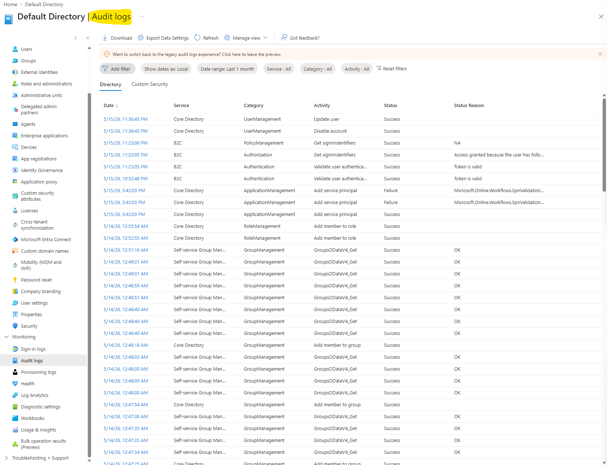

### Administrative Role Assignment Event
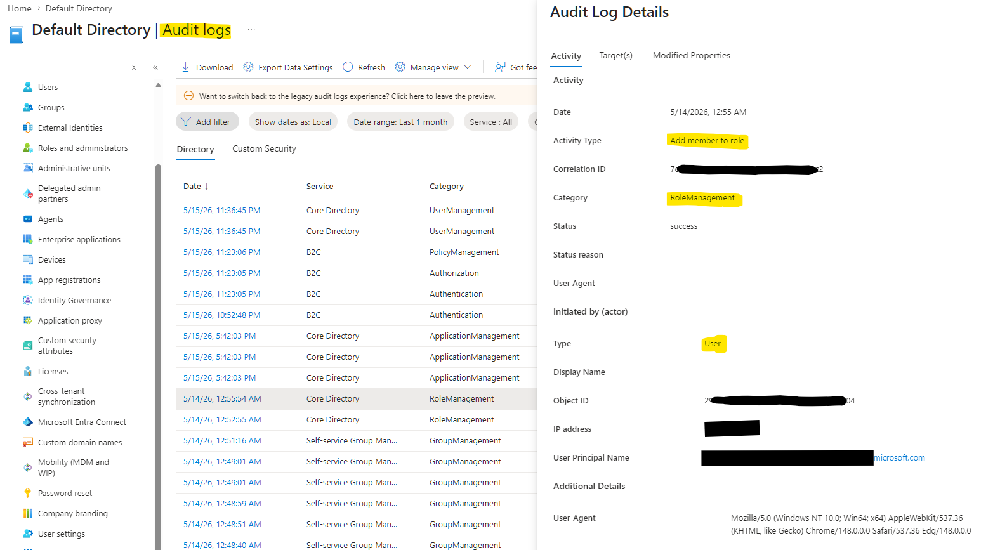

### User Account Audit Activity
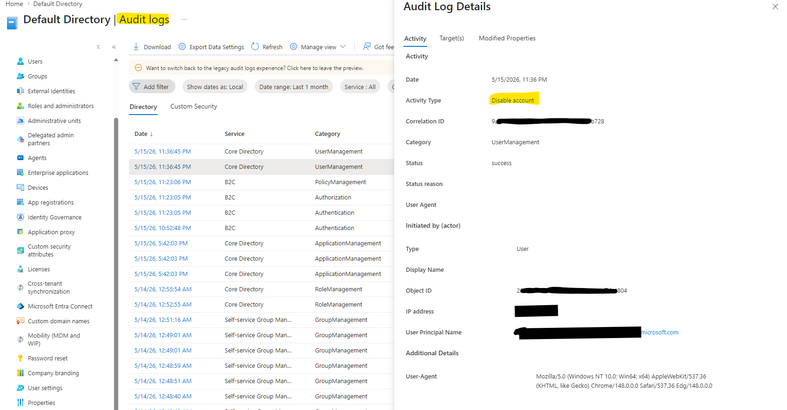

## Step 7: Joiner / Mover / Leaver (JML) Lifecycle Simulation

A Joiner-Mover-Leaver (JML) identity lifecycle workflow was simulated within Microsoft Entra ID.

Lifecycle activities performed:

Joiner:
- Created new employee account for David Brooks
- Provisioned departmental access through Marketing-Team group membership
- Applied least privilege principles by avoiding unnecessary administrative access

Mover:
- Simulated departmental transfer for Emily Carter from Sales to Finance
- Removed obsolete Sales-Team access
- Assigned updated Finance-Team membership

Leaver:
- Disabled sign-in access for Michael Torres
- Removed HR-Team group membership

Key IAM concepts practiced:
- Identity lifecycle management
- Access provisioning
- Access deprovisioning
- Privilege creep prevention
- Role transition hygiene
- Least privilege enforcement

### New Employee Provisioning
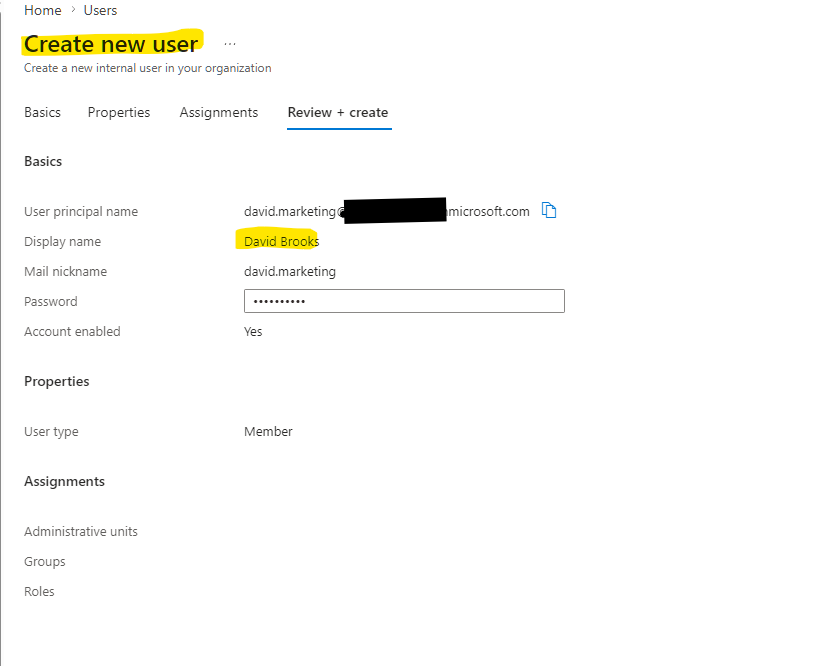

### Department Transfer Process
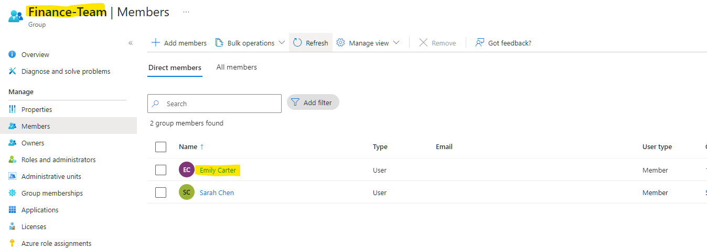

### Offboarding Workflow
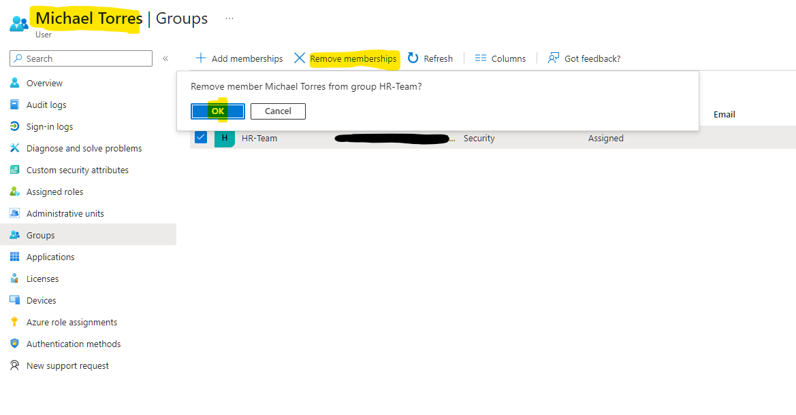

## Step 8: MFA and Identity Security Hardening

Identity security hardening controls were reviewed within Microsoft Entra ID to strengthen account protection and reduce identity-based attack risk.

Security activities performed:
- Reviewed Microsoft Security Defaults configuration
- Evaluated MFA enforcement capabilities
- Reviewed available authentication method controls

Security rationale:
- MFA significantly reduces account compromise risk from password attacks
- Administrative accounts should require strong authentication protections
- Identity-focused controls are critical in modern cloud security environments

Enterprise Recommendation:
- Implement Conditional Access policies requiring MFA for privileged administrative accounts
- Enforce phishing-resistant MFA methods where possible
- Restrict legacy authentication protocols

Key IAM/Security concepts practiced:
- Multi-Factor Authentication (MFA)
- Identity hardening
- Authentication security
- Conditional Access concepts
- Zero Trust security principles

### Security Defaults Configuration
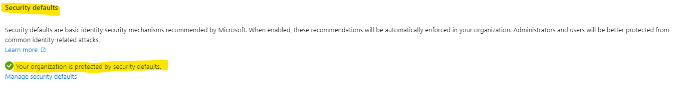

### Authentication Methods Review
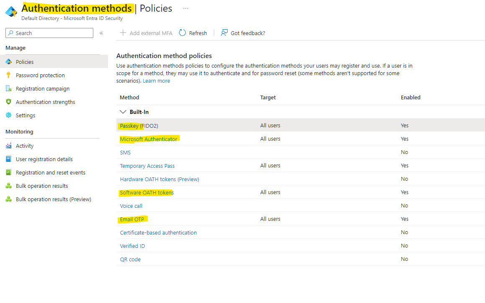

## Step 9: Sign-In Log Investigation and Identity Monitoring

Microsoft Entra ID sign-in logs were reviewed to investigate authentication activity and simulate identity-focused SOC analysis workflows.

Activities performed:
- Reviewed successful authentication events
- Generated failed authentication activity for investigation practice
- Analyzed sign-in metadata including:
  - timestamps
  - IP/location information
  - authentication status
  - application access
  - failure reasons

Findings:
- Failed sign-in attempts generated identifiable authentication events
- Successful logins produced detailed audit telemetry
- Sign-in activity was traceable to individual user accounts

Key IAM/Security concepts practiced:
- Identity monitoring
- Authentication investigation
- Failed login analysis
- SOC-style log review
- Cloud identity telemetry analysis
- Identity threat detection fundamentals

### Failed Authentication Investigation
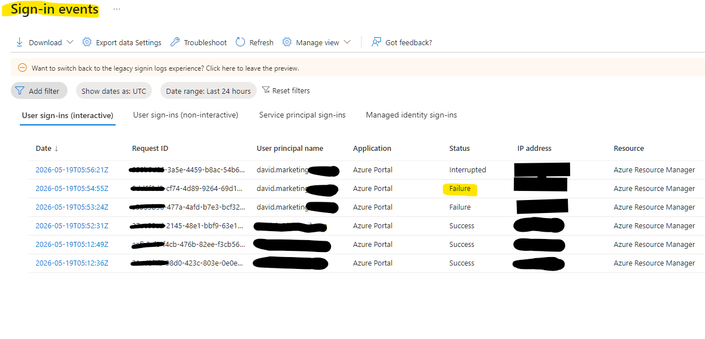

### Detailed Sign-In Telemetry
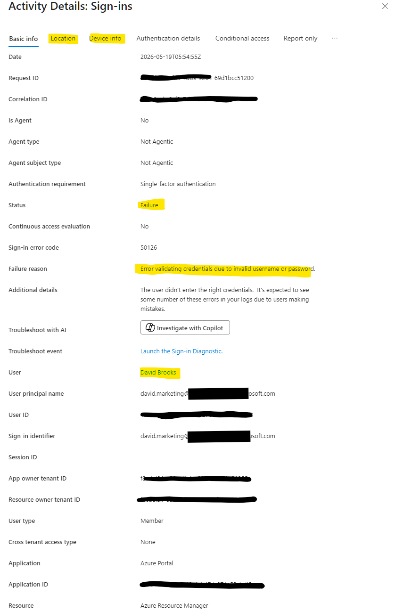

## Step 10: Executive IAM Security Assessment Report

A professional IAM security assessment report was created to document:
- identified security risks
- remediation actions
- governance observations
- future security recommendations

The report simulated enterprise-style security documentation and executive communication workflows commonly performed by IAM and security operations teams.

### Executive Security Findings Report
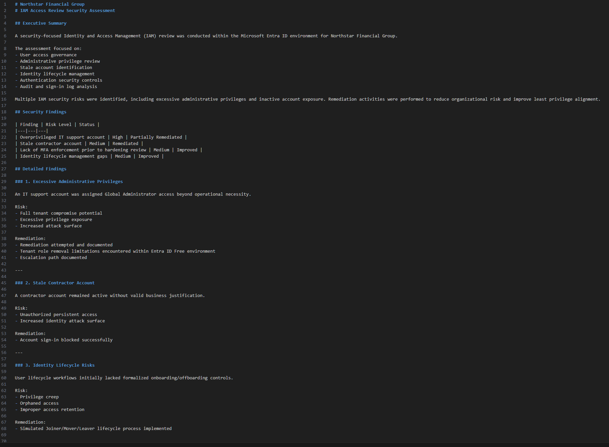

### Read The Report Here
[Executive Assessment Report](/executive-security-report.md)

## Portfolio Outcome

This project was completed as a hands-on IAM and cloud identity security lab to develop practical cybersecurity experience using Microsoft Entra ID.

The lab simulated realistic security analyst responsibilities involving:
- identity governance
- access reviews
- audit investigation
- privileged access analysis
- identity lifecycle management
- cloud security monitoring

The project was documented professionally to demonstrate both technical and security communication skills.
